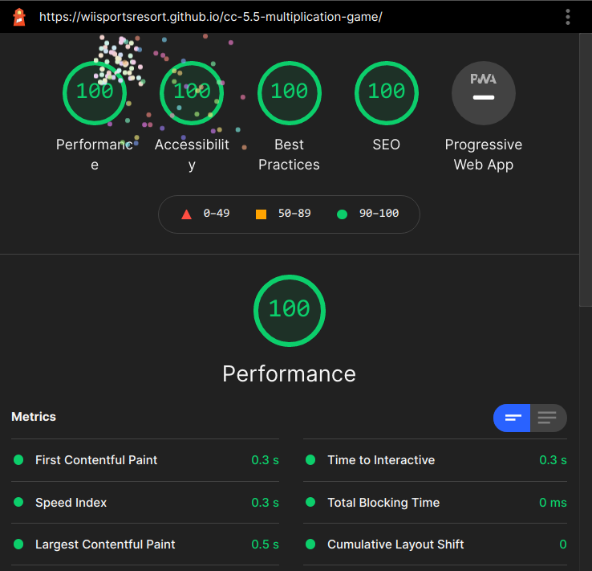
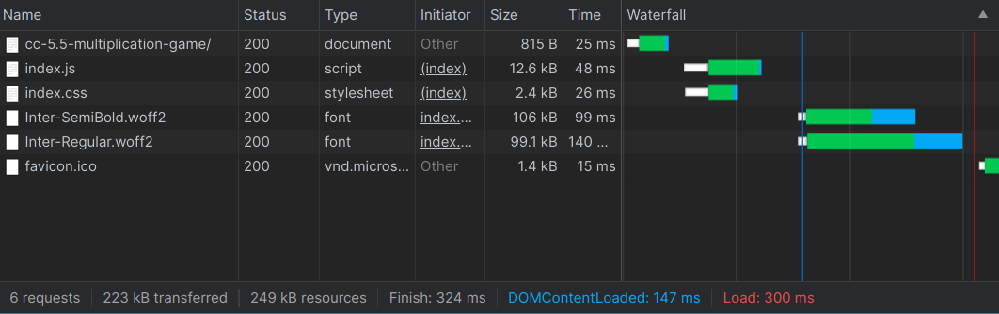
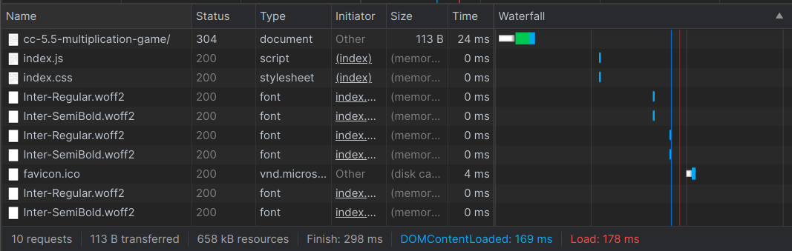

# coding club #5.5

very cool project

go to <https://wiisportsresort.github.io/cc-5.5-multiplication-game> for live demo

I used Svelte and Snowpack instead of React and webpack as I normally did before

Really liking Svelte for the small runtime size, simpler components, among others. Snowpack is just super fast with minimal configuration, both in development and in production

I might leave the church of React become a Svelte guy

Perfect Lighthouse score

Size and performance (no cache)

with cache

## extra stuff (why not)

- it is a performant web app
- difficulty choice, ranging from easy (1 - 5) to impossible (2^10 - 2^32)
- speedrun timer
- option to add time if you blunder
